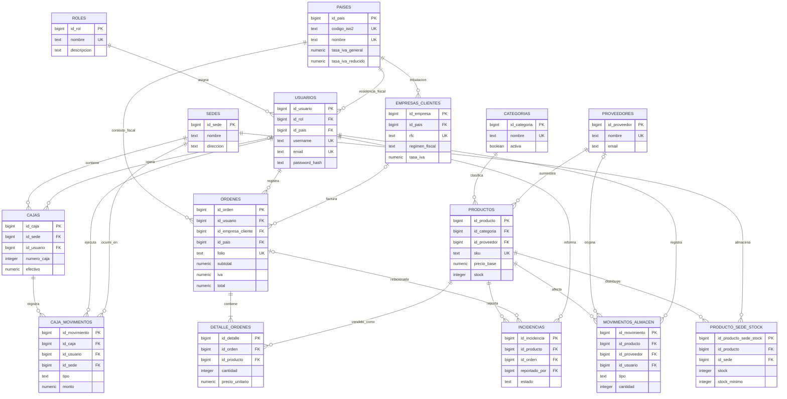

# Diagrama entidad–relación (3FN)

## Justificación de tercera forma normal

- **Primera forma normal:** todos los atributos contienen valores atómicos; los productos de una orden se guardan como filas independientes en `detalle_ordenes`.
- **Segunda forma normal:** cada tabla utiliza una clave primaria simple y sus atributos dependen completamente de ella. La relación producto–sede se resuelve mediante `producto_sede_stock` con unicidad compuesta.
- **Tercera forma normal:** roles, países, categorías, proveedores y sedes se separan en catálogos. Sus datos descriptivos no se repiten en usuarios, productos u órdenes.
- Los campos `sku`, `nombre_producto`, `tasa_iva` e importes de una venta son **instantáneas históricas deliberadas**, no dependencias transitivas: preservan el comprobante aunque cambien el catálogo o las reglas fiscales.
- `caja_movimientos.id_sede` es una dimensión de auditoría explícita para consultas históricas. La sede registrada representa el lugar del evento y no se deriva de la asignación actual de la caja.

El DDL ejecutable se encuentra en [`../database/schema.sql`](../database/schema.sql).
